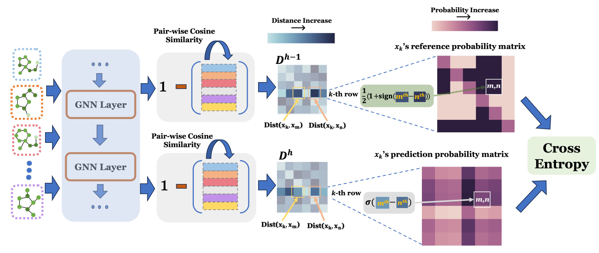

# Exploring Consistency in Graph Representations: from Graph Kernels to Graph Neural Networks

**Paper**: Xuyuan Liu, Yinghao Cai, Qihui Yang, Yujun Yan. Exploring Consistency in Graph Representations: from Graph Kernels to Graph Neural Networks. Conference on Neural Information Processing Systems (NeurIPS), 2024.

*Link*:

<p align="center">

</p>


**Citation (bibtex)**:

```
TODO
```


# Requirements
- `torch==2.3.0`
- `torch-geometric==2.5.3`
- `ogb==1.3.1`


# File Overview
- `run_dist.py`: main script to train the model with consistency loss

- `exp_run.py`: main script to train the model without consistency loss

- `model.py`: models used in the experiments

- `dataset.py`&`dataset.ogb.py`: datasets used in the experiments

  

# Usage

To run all experiments, `run.sh` is provided:

```bash
bash ./run.sh
```


To train a specified model with consistency loss on a given dataset: Take `GCN` and `PROTEINS` as an example

```bash
python run_dist.py --model=GCN --dataset=PROTEINS --device=0
```


To train a specified model without consistency loss on a given dataset:

```bash
python exp_run.py --model=GCN --dataset=PROTEINS --device=0
```


Since consistency loss can be computed using only layer outputs, and related functions are incorporated via Python decorators, it is easy to test your own model with consistency loss. To do so, simply load your model in the `get_model` function within `train_dist.py`, set the appropriate parameters, and the consistency loss will be calculated automatically.

Before testing, please ensure that:

- Your model has a defined layer structure
- Your model can return layer outputs, which represent the hidden features of each graph


# Need help? 

Email xuyuan.liu.gr@dartmouth.edu or yinghao.cai@dartmouth.edu